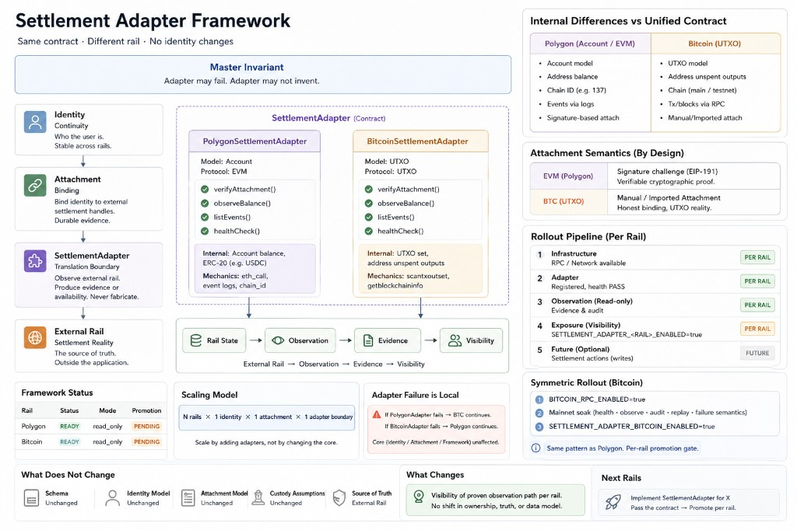

# Settlement Adapter Framework

**Status:** Architecture closure → operational promotion phase



The core is stabilized. Extension lives at the periphery. Phase A–D are **closed** at the architecture level. What remains is operational proof and deployment promotion — not new design.

**This document and diagram are the architecture capstone** — onboarding and reference for any next rail, not decorative illustration. They encode what the code already proves.

---

## Documentation chain

```text
Phase A   Identity correctness         → Is identity correct?
              ↓
Phase B   Identity continuity          → Is identity durable?
              ↓
Phase C   Authority separation         → phase-c-settlement-attachment-closure.md
              ↓
Phase D   Capability promotion         → phase-d-adapter-operational-stability.md
              ↓
Settlement Adapter Framework             → this document + diagram
              ↓
Rail promotions                          → soak → SETTLEMENT_ADAPTER_*_ENABLED
```

There is no further **architecture PR**. Only operational evidence per rail:

```text
mainnet soak  →  promotion  →  next adapter
```

---

## Diagram reference (what it encodes)

**1. Internal vs external contract** — Polygon (account, logs, `chain_id`) and Bitcoin (UTXO, tx/block, unspent outputs) share one outward contract: `verifyAttachment`, `observeBalance`, `listEvents`, `healthCheck`. Two fundamentally different models in one boundary without core hacks = boundary chosen correctly.

**2. Attachment semantics** — No false claim that every network has the same ownership proof. Invariant: **verified binding**. Mechanism: network capability (EVM signature challenge vs BTC manual/imported).

**3. Failure isolation** — `PolygonAdapter` or `BitcoinSettlementAdapter` failure does not break Identity, Attachment, or framework. Only the observation path fails.

**4. Scaling formula** — `N rails × 1 identity × 1 attachment × 1 adapter boundary` is operational: new chain → new `SettlementAdapter` → same gates → same promotion — not new identity flow or storage model.

---

Polygon is the **first production path**. Bitcoin is the **first proof** that the framework is rail-agnostic — same contract, different rail, no identity changes.

```text
Identity
    |
    v
Attachment
    |
    v
SettlementAdapter
    |
    +--> PolygonSettlementAdapter
    |
    +--> BitcoinSettlementAdapter
    |
    v
External Rail
```

**Architectural test passed (BTC):**

```text
Same contract
Different rail
No identity changes
```

---

## Final model

| Layer | Role |
|-------|------|
| Identity | continuity |
| Attachment | durable binding |
| SettlementAdapter | translation + observation boundary |
| External Rail | settlement reality |

```text
Identity
    ↓
Attachment
    ↓
SettlementAdapter Contract
    ↓
External Rail
```

**Single source of truth:**

```text
External Rail
    ↓
Observation
    ↓
Evidence
    ↓
Visibility
```

---

## Authority model (canonical)

Three **orthogonal** authorities govern Vault + settlement. They are **not** stages of one escalation ladder. Connect → `read_only` → `full` does **not** mean “the platform gains more control over the wallet.”

| Authority | Who controls it | What it means |
|-----------|-----------------|---------------|
| **Identity authority** | Vault / SL1 (`sl1e_`) | This address belongs to this identity; binding is verified |
| **Wallet authority** | MetaMask / Unisat (external) | Keys and transaction signing stay outside the platform |
| **Settlement authority** | Settlement adapter (`read_only` \| `full`) | What settlement APIs Meanly exposes for a rail |

```text
Identity authority          Wallet authority           Settlement authority
        │                           │                            │
        └── Connect                 └── External wallet only     ├── read_only
                                                               └── full
```

**Capability ladder (settlement layer only):**

```text
read_only  = verify attachment + observe balance
full       = verify + observe + settlement proof submission
             (not: platform can move funds)
```

**Per-rail example (same identity, different settlement modes):**

```text
sl1e_
  ├─ Polygon attachment   → adapter mode: full
  ├─ Bitcoin attachment   → adapter mode: read_only
  └─ Future rail          → adapter mode: (independent)
```

Identity object, wallet keys, and rail choice remain independent. Changing adapter mode or adding a rail does **not** redefine `sl1e_`.

> **Canonical statement:** A wallet attachment grants identity verification, not wallet control. Settlement adapter modes govern settlement capabilities only. Enabling `full` permits settlement proof submission and related settlement actions, but does not grant custody, signing authority, or transfer authority over user funds.

**Code alignment:**

- Connect / binding challenge → identity authority (`WalletBindingChallengeService`, verified `IdentityBinding`)
- `SettlementAdapterConfig::allowsWrite()` → `enabled && mode === 'full'` → settlement authority only
- `can_submit_transfer_proofs` in wallet summary → `crypto_rails_enabled && allowsWrite(merchant_crypto_network)` (default rail: polygon)
- Proof endpoints reject with *“Settlement write actions are disabled…”* — not wallet actions

**SL1 formula:**

```text
Identity is durable.
Wallets are attachments.
Rails are adapters.
Settlement modes are capabilities.
```

**Axiomatic form (model-level — rail-agnostic):**

```text
Identity is durable.
Wallets are attachments.
Rails are settlement adapters.
Adapter modes grant settlement capabilities,
not wallet control.
```

**Layer boundary invariants:**

```text
Identity layer     never gains wallet authority
Wallet layer       never becomes identity
Settlement layer   never becomes custody
```

**Feature review (any new capability):**

```text
What changes?
□ Identity authority
□ Wallet authority
□ Settlement authority
```

| Feature | Identity | Wallet | Settlement | Notes |
|---------|:--------:|:------:|:------------:|-------|
| Polygon transfer proof | | | ✓ | `BindingProofVerificationService`, `allowsWrite()` |
| New Bitcoin observer | | | ✓ | May extend attachment model; not identity |
| New wallet binding flow | ✓ | | | Connect / challenge only |
| Merchant checkout rail | | | ✓ | Not wallet custody |

If a design checks **Wallet authority** for the platform, or conflates Connect with `full`, stop — boundary violation.

**Phase D scope (post–Phase C — capability promotion only):**

```text
May change:
  ✓ adapter mode (read_only → full, per rail)
  ✓ proof submission
  ✓ settlement workflows
  ✓ merchant rails
  ✓ checkout rails

Must not change:
  ✗ identity model
  ✗ attachment model (identity verification semantics)
  ✗ wallet custody model
  ✗ authority boundaries (Identity / Wallet / Settlement)
```

Future PRs should be discussable at *“Which settlement capabilities are enabled?”* — not by reopening identity, key custody, or authority boundaries. If a proposal needs platform wallet authority, it is a new architectural phase, not Phase D.

**Related:** [Phase C — Authority Separation](phase-c-settlement-attachment-closure.md) · [Phase D — Capability Promotion](phase-d-adapter-operational-stability.md)

---

**Master invariant (framework-wide — not Polygon-specific):**

```text
Adapter may fail.
Adapter may not invent.
```

**Operational rules (derived):**

```text
rpc_error           ≠  0 balance
unavailable         ≠  empty
failed observation  ≠  state mutation
```

**Forbidden:**

```text
UI/cache  →  truth                    ✗
RPC error →  0 balance                 ✗
failure   →  attachment change         ✗
failure   →  fake observation           ✗
```

---

## Current state (architecture closure)

```text
Phase A  Identity correctness        CLOSED   → Is identity correct?
Phase B  Identity continuity         CLOSED   → Is identity durable?
Phase C  Authority separation        CLOSED   → Are authorities separated?
Phase D  Capability promotion        CLOSED   → Which settlement capabilities are enabled?

Polygon adapter    READY  (production path — soak → promotion PENDING)
Bitcoin adapter    READY  (promotion gate PENDING)
Exposure           PENDING per rail
```

**Remaining (operational only):**

```text
Mainnet soak
      ↓
Operational evidence
      ↓
Promotion
```

---

## Adapter failure is local

If `PolygonAdapter` fails:

```text
PolygonAdapter
      X
```

That does **not** mean:

```text
Identity broken          ✗
Attachment lost          ✗
Settlement model invalid ✗
```

Only the specific **observation path** fails. Identity, attachment, and framework contract remain valid. The same applies to `BitcoinSettlementAdapter`.

---

## Rail implementations (internal difference, external contract)

Differences stay **inside** the adapter. Outward both expose:

```text
verifyAttachment()
observeBalance()
listEvents()
healthCheck()
```

| Rail | Internal model | Observation |
|------|----------------|-------------|
| Polygon | account model | ERC-20 + RPC `balanceOf` |
| Bitcoin | UTXO model | RPC `scantxoutset` / unspent outputs |

**Attachment proof (honest, not unified):**

| Rail | Verified binding via |
|------|----------------------|
| EVM (Polygon) | signature challenge |
| UTXO (Bitcoin) | manual / imported (for now) |

The attachment contract is always **verified binding**. Proof mechanism is a **network/adapter capability** — not forced into one shape.

**BTC confirmed invariant:**

```text
scantxoutset unavailable  →  balance_unavailable
NOT  →  0 BTC
```

---

## Framework status

```text
Settlement Adapter Framework
Rails:
    Polygon     READY / production path (soak → promotion PENDING)
    Bitcoin     READY / promotion gate PENDING
Core:
    Identity        unchanged
    Attachment      unchanged
    Truth model     unchanged
```

**Scaling (proven by BTC):**

```text
N rails  ×  1 identity continuity  ×  1 attachment contract  ×  1 adapter boundary
```

BTC is not a second system layer. It is proof the system was built as a settlement adapter framework — not a Polygon integration with a nice name.

---

## Enablement hierarchy (rollout pipeline)

Each level requires the previous; none redefines the layer below. **Symmetric per rail:**

```text
Polygon:
1. POLYGON_RPC_ENABLED=true
2. Mainnet soak (health, observation, audit, replay, failure semantics)
3. SETTLEMENT_ADAPTER_POLYGON_ENABLED=true

Bitcoin:
1. BITCOIN_RPC_ENABLED=true
2. Mainnet soak (same gate)
3. SETTLEMENT_ADAPTER_BITCOIN_ENABLED=true
```

```text
1. Infrastructure     RPC available
2. Adapter            registered + healthCheck() PASS
3. Observation        read_only evidence path proven
4. Exposure           SETTLEMENT_ADAPTER_*_ENABLED=true
5. Future             settlement actions (mode=full)
```

Later, separately: `blockchain_networks.networks.*.enabled` — network feature rollout, not observation trust.

Level 4 opens **visibility** to a proven read path only — not writes, transfers, or custody.

---

## Operational promotion (after mainnet soak PASS)

`SETTLEMENT_ADAPTER_POLYGON_ENABLED=true` is a **deployment state change** — not an architectural event.

**Unchanged:** schema, identity, attachment, custody, truth model.

**Changed:** visibility of proven observation path.

```env
SETTLEMENT_ADAPTER_POLYGON_ENABLED=true
SETTLEMENT_ADAPTER_POLYGON_MODE=read_only
```

```text
Exposure              ENABLED   ← was PENDING
```

**Release artifact:** [Promote Settlement Adapter Observation Path](promote-settlement-adapter-observation-path.release-note.md)

**Soak checklist:** [Phase D — Mainnet Soak](phase-d-adapter-operational-stability.md#mainnet-soak-gate)

---

## Adding a new rail (same gate)

Architecture does not grow by number of networks. It grows by **implementations of one contract**.

```text
1. implement adapter
2. prove:
       verifyAttachment()
       observeBalance()
       listEvents()
       healthCheck()
3. pass operational invariant
4. expose
```

A new rail **integrates downward** — it may not grow upward into identity or settlement core.

```text
NewRailAdapter implements SettlementAdapter
```

**Scaling:**

```text
N rails  ×  1 identity contract  ×  1 attachment model  ×  1 adapter boundary
```

Not: `N rails × N custom identity flows`

---

## Phase references

| Phase | Document | Status |
|-------|----------|--------|
| A — Identity correctness | (operational proof) | CLOSED |
| B — Identity continuity | (operational proof) | CLOSED |
| C — Authority separation | [phase-c-settlement-attachment-closure.md](phase-c-settlement-attachment-closure.md) | CLOSED |
| D — Capability promotion | [phase-d-adapter-operational-stability.md](phase-d-adapter-operational-stability.md) | CLOSED (soak → promotion PENDING) |

**Code:**

- `app/Contracts/SettlementAdapter.php`
- `config/settlement_adapters.php`
- `app/Services/SettlementAdapters/PolygonSettlementAdapter.php`
- `app/Services/SettlementAdapters/BitcoinSettlementAdapter.php`

**Tests:**

- `tests/Feature/SettlementAdapterHealthTest.php`
- `tests/Feature/SettlementAdapterObservationReplayTest.php`
- `tests/Feature/SettlementAttachmentOperationalDrillTest.php`
- `tests/Feature/BitcoinSettlementAdapterTest.php`
